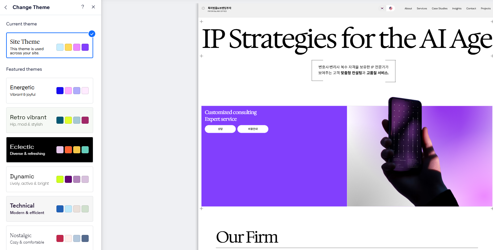
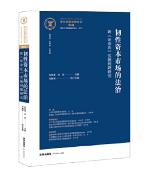
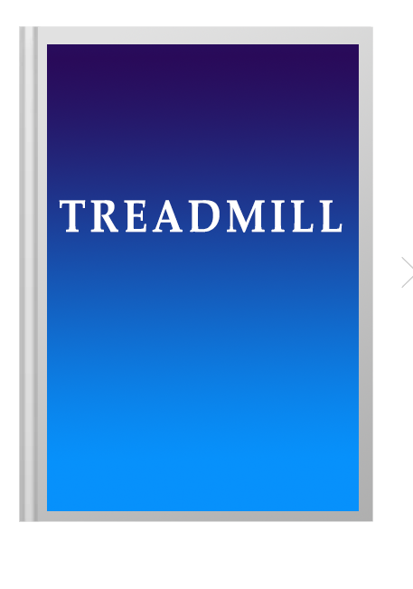
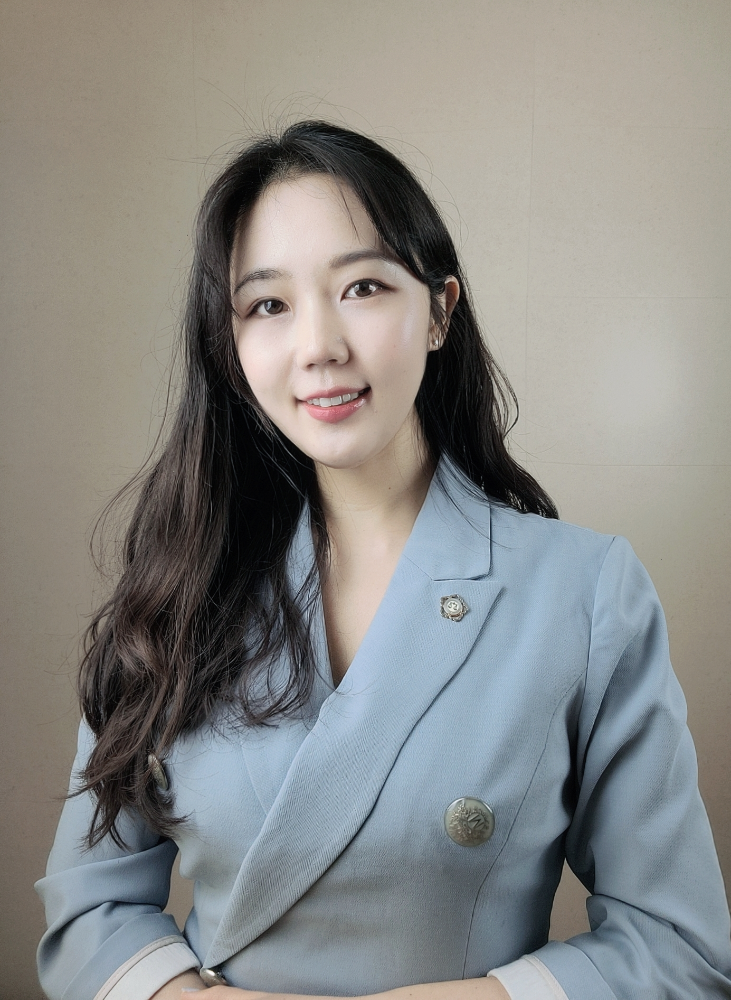
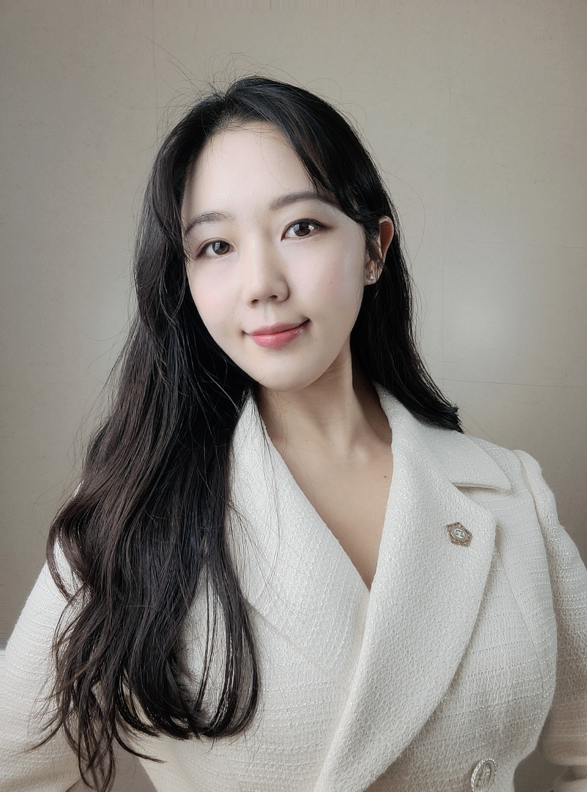

# 웹싸이트

## 메인: 홈/소개/서비스/ 상담//linkedin/한,영,중

참조: 오예리특허법률사무소 골격에- 유레카등 컨텐츠 추가

[오예리 특허법률사무소 | 특허·상표·디자인 전문](https://lawer-website-gamma.vercel.app/)

[상표등록/상호등록/특허등록/디자인등록/변리사상담 | 유레카 특허법률사무소](https://eurekapat.com/)

[www.hupat.com](http://www.hupat.com/)

[법무법인민후](https://minwho.kr/kr/)

### 1. 홈

<오예리부분+유레카>  

꿈을 현실로 만들어 드립니다?

차별점 

1. **출원 -  법률자문 - 소송 -투자유치 자료  까지 변호사 및 변리사의 1:1** 
2. **전문성 : 의료, 뷰티, 디자인**  
3. **강점: 영어, 중국어 소통가능** 
- 업무분야 문구변경 (여섯개 분야 유지)
- 진행절차, 자주묻는 질문 유지 (다만 상담 비용만 다르게)

### 2. 소개

**오예리 대표 변호사,변리사**

# **기술과 브랜드를 함께 읽습니다**

심사와 심판 실무를 두루 거친 변리사가 출원부터 등록, 이후 분쟁까지 맡습니다. 발명의 핵심과 브랜드의 쓰임을 정확히 파악해, 사업 목표에 맞는 권리를 설계합니다.

- · 특허·상표·디자인 출원 및 등록 전 과정 대리
- · 거절이유·의견제출통지 대응 및 심판 수행
- · 침해 감정, 경고장 대응, 지식재산 소송 지원
- · PCT·마드리드 등 해외출원 포트폴리오 설계

- 참조: [INFO] WIPO
    
    안녕하세요!
    다들 잘 지내고 계신가요? 다름이 아니라 WIPO에서 다양한 IP Learning Course를 제공하는데, 일부 코스는 무료이고 수료하면 certificate도 줍니다! 저도 이번에 수강하는데 관심있는 분들 계실 것 같아서 공유합니다. 특히DL-101 General Course on Intellectual Property 추천합니다! 그리고 혹시 제네바나 스위스 오게되면 꼭 연락주세요. 다들 좋은 주말 보내세요😊
    
    [Academy Course Catalog](https://welc.wipo.int/acc/index.jsf?page=courseCatalog.xhtml&lang=en&cc=DL001E#plus_DL001E)
    
    <aside>
    
    **1. 직무의 희소성과 공석(Vacancy)의 빈도**
    
    - **변리사 (IP 전문가):** WIPO(세계지식재산기구)라는 거대 기구가 아예 이 분야를 위해 존재합니다. WIPO는 연중 상시로 특허, 상표, 법무 관련 전문가를 채용하며, 한국은 세계 4~5위권의 특허 출원국이라 한국인 전문가에 대한 수요가 기본적으로 깔려 있습니다.
    
    **2. 한국인의 경쟁력 (Geographical Distribution)**
    
    - 국제기구는 국가별 쿼터나 지역적 균형을 고려합니다.
    - **IP 분야:** 한국은 특허 강국으로서 WIPO 내에서 한국인 전문가들의 입지가 상당히 탄탄합니다. 변리사로서의 실무 경력은 국제무대에서 즉시 전력감으로 인정받기 쉽습니다.
    
    **3. 가장 '합격 확률이 높은' 전략: 하이브리드 접근**
    
    가장 쉬운 길은 어느 하나를 선택하는 것이 아니라, **변리사 자격으로 들어가서 의료 전문성을 얹는 방식**입니다.
    
    - **WIPO의 'Life Sciences' 부서:** 제약 특허, 바이오 기술 관련 지재권 이슈를 다루는 곳입니다. 이곳에서는 변리사 자격증이 필수이면서, 의료 전문 변호사로서의 지식이 있다면 '대체 불가능한 후보'가 됩니다.
    - **MPP(의약품 특허풀):** 공중보건을 위해 제약 특허를 관리하는 국제기구입니다. 여기서는 변리사 실무와 의료법 지식을 동시에 갖춘 사람을 찾기가 하늘의 별 따기 수준입니다.
    </aside>
    

---

# 변경 사항

테마 및 색상 참조 

[Home | My Site 22](https://yerioh28.wixsite.com/my-site-22)

<aside>

③ 모던 차콜 & 소프트 피치 핑크
"트렌디한 디자인 권리와 트렌디한 뷰티 브랜드 타겟"

주조색 (배경): 화이트

보조색 (브랜드): 지적인 차콜 그레이 (#2D3748)

강조색 (포인트): 감각적인 뮤트 핑크 / 피치 (#E5A99E)

느낌: 주로 젊은 뷰티 스타트업 대표나 디자이너 고객들을 타겟으로 할 때 유용합니다. 트렌디하고 감각적인 소통이 가능한 젊은 변리사 사무소의 느낌을 전달합니다.

</aside>

### <홈>

- “무료 상담 신청” → 상담 신청
- 3,200+ →24시간 컨테이너 유지 (안에 컨텐츠만 수정예정임)

| 의료 & IP 전략 
(Medical Malpractice & IP Strategy) | 영어 중국어  | 9년+ | 몰겠음 |
| --- | --- | --- | --- |
| 전문성  | 소통가능  | 실무경력  | 칸 남겨줘  |
- 외국어(영중한추가)
- 한국어클릭은 블로그연동/ 중한은 링크드인연동
- 전화X → 카톡상담, 게시판상담으로 한정
- 로고(특허청, 키프리스, 한국발명진흥회, 특허심판원, 특허법원, 칭화대) 추가

### <소개>

dual-qualified Attorney-at-Law & Patent Attorney(Korea)

- 전문분야 추가: Medical Malpractice & IP Strategy

| 의료  | IP 전략  |
| --- | --- |
|   • 20년차 신경외과 및 영상의학과 전문의 자문  |   • 중국 IP 금융 자문  |
|   • 의료소송 했던것들  리스트업
  • 자문했던거 리스트업  |   • 출원(수술도구,슬리퍼) 리스트업 (뷰티/환경등다) 
  • 자문 리스트업  |

저서  (클릭하면 무료배포 또는 구매페이지로 넘어갈수 있게) 

### <서비스>

상세안내 

1. IP(특허,디자인,상표)등록
- 특허 등록 비용,절차: 140
- 상표 등록 비용,절차: 빠른20+20/기본6+12/
- 디자인 등록 비용, 절차: 30+30
- 저작권 등록 비용, 절차: 30
1. 해외출원    
2. 조사~~( 임대표님 같이)~~ 
- 선행기술조사
- 기술가치평가, 기술이전, 라이선스 컨설팅
- 시장조사
1. 전략(국내외진출/ IR 및 투자유치) 
- 특허맵, IP-R&D 컨설팅, IP 포트폴리오 설계
1. 침해 대응 및 민 • 형사 소송 
- 특허권 등 침해여부 법률검토
- 특허권 등 침해 내용증명 작성
- 특허권 등 침해금지 가처분, 청구
- 특허권 등 침해 민·형사소송
- 병행수입 분쟁 대응
- 통관보류 분쟁 대응
- 권리범위 확인 심판
1. 영업비밀, 부정경쟁행위 
- 영업비밀침해 여부 자문
- 전직금지가처분
- 비밀유지계약서, 전직금지 약정서
- 부정경쟁행위 내용증명 작성

### <상담>

- 무료상담
- 변호사법 의거 비용 기본 30분/5만원
- 난이도 있는것 time charge 얼마